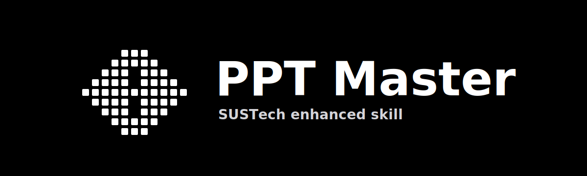

<p align="center">
  
</p>

<p align="center">
  <strong>document in · editable PPTX out</strong>
</p>

<p align="center">
  AI-assisted presentation generation for agent workflows.<br>
  SVG-first pages, native editable PPTX export, SUSTech-enhanced templates.
</p>

<p align="center">
  <a href="VERSION"></a>
  <a href="https://github.com/lengmh/ppt-master-sustech-skill/stargazers"></a>
  <a href="https://github.com/lengmh/ppt-master-sustech-skill/commits"></a>
  <a href="LICENSE"></a>
  <a href="RELEASE_META.json"></a>
</p>

<p align="center">
  <a href="#快速开始">Quick Start</a> ·
  <a href="#功能亮点">Features</a> ·
  <a href="#sustech-增强内容">SUSTech</a> ·
  <a href="docs/README.md">Docs</a> ·
  <a href="https://github.com/lengmh/ppt-master-sustech-skill/releases">Releases</a>
</p>

# PPT Master SUSTech 增强版 Skill

`ppt-master` 是一个面向 agent 环境的演示文稿生成 skill，可将 PDF、DOCX、PPTX、网页、Markdown、Excel 等材料转换为高质量 SVG 页面，并导出为可编辑 PPTX。

本仓库提供 SUSTech 增强版本线源码，适合在 Claude Code、Codex、Cursor 等具备 agent 能力的环境中使用。

## 版本信息

| 项目 | 值 |
|---|---|
| Release Version | `r2.10.0-v0.3.0` |
| Upstream Baseline | `hugohe3/ppt-master@v2.10.0` |
| Upstream Commit | `34d1f0057d51ff2cc15bcbbec071ef35f6fc1ae1` |
| Tracked Range | `v2.10.0..137e0e5ebc385620e9cc95fcc56d8f67e3d8c3a9` |
| Root Directory | `ppt-master/` |

Release page:

- <https://github.com/lengmh/ppt-master-sustech-skill/releases>

## 功能亮点

- 支持 PDF、DOCX、PPTX、网页、Markdown、Excel 等多种输入源。
- 通过 `design_spec.md` 和 `spec_lock.md` 驱动设计意图与执行约束。
- 采用 SVG-first 页面构建流程，并导出可编辑 PPTX。
- 支持浏览器 live preview，用于查看页面、direct edit 和提交标注。
- 支持 Confirm UI 与 native PPTX template-fill 上游工作流。
- 支持 `brand / layout / deck` 三分模板体系。
- 支持 AI image manifest 工作流和图像 prompt catalog。
- 内置 chart templates、图表校验指引、speaker notes、动画与导出辅助能力。
- 内置 `ppt_text_normalize` Safe MVP：提供 `scan` / visual review gate / `apply` PPTX 文字样式归一化。
- 支持 opt-in `visual-review`，用于渲染后页面检查。
- 支持 LaTeX 公式渲染：通过 `scripts/latex_render.py` 和 `images/formula_manifest.json` 生成公式 PNG 资产。

## SUSTech 增强内容

本版本保留上游 v2.10.0 能力，并叠加以下 SUSTech 增强：

- live-preview 融合 upstream staged direct edit：drag / resize / arrow nudge 等确定性编辑写入 staged edit；annotation 保留给需要 AI 判断的修改；继续保留 text-layout issue 检测。
- 模板创建审计流：`brief_lock.json`、strict validation mode、template preview feedback。
- SUSTech 与组织模板统一整理为 `templates/decks/` 条目。
- 已清理旧品牌类 `templates/layouts/`；该目录现在只保留结构型 layout presets。
- 正式纳入 `ppt_text_normalize` Safe MVP：以保守 `scan` / `apply` 流程处理 PPTX 文字样式漂移，并提供正式支持、运行时可选的 visual review gate 作为人工审核层。
- visual review gate 支持按文本块显式开放非常规字段，用于人工指定颜色等安全字段对齐；字号仍保持禁用。
- 通过 `VERSION` 和 `RELEASE_META.json` 记录版本、上游基线和追踪范围。
- 通过 [`docs/Roadmap.md`](docs/Roadmap.md) 记录 SUSTech 增强清单和上游兼容关注项。

## `ppt_text_normalize` 当前源码命令面

当前源码命令面包含：

- `scripts/ppt_text_normalize/scan.py`
- `scripts/ppt_text_normalize/build_review_workspace.py`
- `scripts/ppt_text_normalize/compile_review_decisions.py`
- `scripts/ppt_text_normalize/apply.py`
- Safe MVP 保守归一化语义与配套报告输出
- 正式支持的 opt-in visual review gate：浏览器只保存 `review_decisions.json`，`compile_review_decisions` 生成 `rules_reviewed.json`，最终仍由 `apply.py` 执行 PPTX 修改

## 目录结构

```text
SKILL.md                 # agent 主入口
VERSION                  # 当前 release 版本
RELEASE_META.json         # 版本、上游基线与追踪范围元数据
.env.example              # 环境变量示例
requirements.txt          # Python 依赖列表
references/               # agent 角色参考与生成指引
scripts/                  # 转换、渲染、预览、导出、模板等辅助脚本
templates/                # brands / layouts / decks / charts / icons
workflows/                # live-preview、create-template、template-fill、visual-review、图表校验等流程
docs/                     # 使用与设计文档
```

## 快速开始

```bash
python3 -m venv .venv
source .venv/bin/activate
pip install -r requirements.txt
cp .env.example .env
```

然后根据需要在 `.env` 中配置模型、图像生成、搜索、TTS 等 provider。

agent 主入口：

```text
SKILL.md
```

常用 CLI 检查：

```bash
python3 scripts/svg_to_pptx.py --help
python3 scripts/svg_editor/server.py --help
python3 scripts/latex_render.py --help
python3 scripts/visual_review.py --help
python3 scripts/register_template.py --help
```

说明：`visual-review` 只有在执行真实浏览器渲染时才需要 Playwright / Chromium；基础安装不强制要求。

## 更多文档

- [文档索引](docs/README.md)
- [SUSTech 增强路线图](docs/Roadmap.md)
- [技术设计](docs/technical-design.md)
- [模板架构](docs/templates-architecture.md)
- [第三方说明](THIRD_PARTY_NOTICES.md)

## License

本仓库沿用上游 MIT License。详见 [LICENSE](LICENSE)。

## Third-party Notices

内置或引用的图标、品牌标记、来源图片和模板资产可能遵循各自的上游许可证或署名要求。详见 [THIRD_PARTY_NOTICES.md](THIRD_PARTY_NOTICES.md)。
